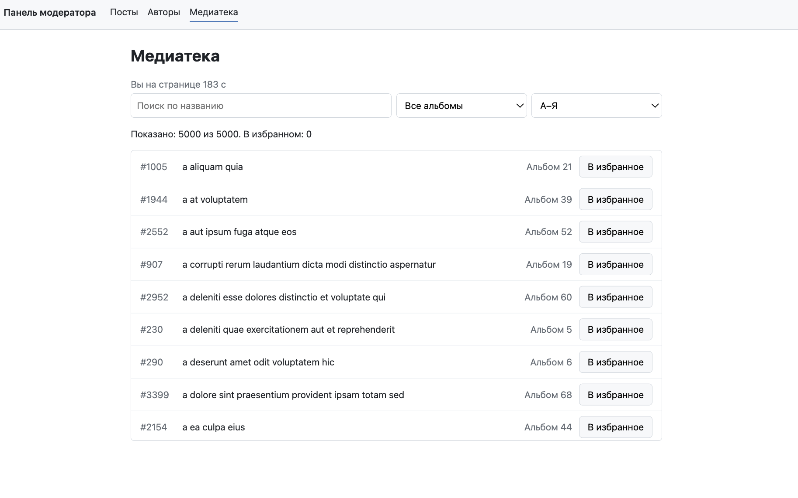

# Панель модератора

Внутренняя панель модератора блог-платформы: просмотр и поиск постов, страница поста с комментариями, список авторов и медиатека на 5000 записей.

Данные приходят с тестового API [JSONPlaceholder](https://jsonplaceholder.typicode.com).

> Учебный проект. Исходное приложение с частично готовыми компонентами предоставлено в рамках курса. Мои доработки: хуки загрузки данных, страницы постов, форма комментария, оптимизация медиатеки и разделение кода. Подробности ниже.



## Стек

- React 18, TypeScript
- Vite
- React Router 6
- TanStack Virtual (`@tanstack/react-virtual`) — виртуализация длинных списков

Без сторонних библиотек для работы с сервером: загрузка данных, отмена запросов и обработка ошибок реализованы на собственных хуках.

## Что реализовано

### Работа с API

**Хук `useFetch`** — загрузка данных с сервера:
- запрос при монтировании компонента и при каждой смене адреса;
- состояния загрузки, ошибки и HTTP-статус ответа;
- ответы 4xx/5xx считаются ошибкой, сетевая ошибка показывается отдельным понятным сообщением;
- отмена устаревшего запроса через `AbortController` при смене адреса и уходе со страницы (защита от гонки запросов);
- повтор запроса по кнопке «Повторить».

**Хук `useDebounce`** — отложенное значение: обновляется, только когда исходное не менялось заданное время.

**Список постов:**
- поиск с задержкой 500 мс — запрос уходит один раз после окончания ввода;
- пагинация по 10 постов, сброс на первую страницу при новом поиске;
- состояния «Печатаете...», загрузка, ошибка с повтором, «Ничего не найдено».

**Страница поста:**
- пост, автор и комментарии загружаются независимо, у каждого блока свои состояния загрузки и ошибки;
- несуществующий пост (ответ 404) отличается от других ошибок: «Пост не найден» и ссылка на список.

**Форма комментария:**
- блокировка кнопки во время отправки;
- очистка полей после успешной отправки, вывод ошибки без потери введённого текста;
- новый комментарий сразу появляется в списке.

### Оптимизация

**Медиатека на 5000 записей** работала с заметными задержками: поиск реагировал медленно, кнопки «В избранное» срабатывали не сразу, страница подтормаживала даже в простое. Найдено и исправлено пять проблем:

| Проблема | Решение |
|---|---|
| Строки списка перерисовывались при каждом рендере страницы | `React.memo` + `useCallback` с функциональным обновлением state |
| Фильтрация и сортировка 5000 записей на каждом рендере | `useMemo` |
| Таймер перерисовывал всю страницу каждую секунду | Перенос state таймера в отдельный компонент |
| Пересчёт списка на каждое нажатие клавиши в поиске | `useDebounce` |
| В DOM находились все 5000 строк | Виртуализация списка |

Подробный разбор каждой проблемы — что происходило, как исправлено и почему выбрано именно это решение — в файле [OPTIMIZATION.md](OPTIMIZATION.md).

**Разделение кода:** страницы загружаются лениво через `React.lazy` и `Suspense`, каждая собирается в отдельный файл. Индикатор загрузки показывается только в области страницы, шапка с навигацией остаётся на месте.

## Запуск

Требуется Node.js 18 или новее.

```bash
npm install
npm run dev
```

Приложение откроется по адресу, который выведет Vite (обычно `http://localhost:5173`).

Другие команды:

```bash
npm run build      # проверка типов и production-сборка в папку dist
npm run preview    # просмотр production-сборки
npm run typecheck  # только проверка типов
```

## Структура проекта

```
src/
  api/endpoints.ts      адреса API
  hooks/                useFetch, useDebounce, useMutation
  components/           общие компоненты: Layout, Loader, ErrorMessage, EmptyState и др.
  pages/                страницы: посты, пост, авторы, медиатека, 404
  utils/                HttpError, simulateHeavyRender
  types.ts              типы данных API
```

## Примечания

- JSONPlaceholder не сохраняет данные: отправленный комментарий отображается только до перезагрузки страницы.
- Функция `simulateHeavyRender()` намеренно имитирует дорогой рендер строки медиатеки — на ней демонстрируется эффект оптимизаций.
